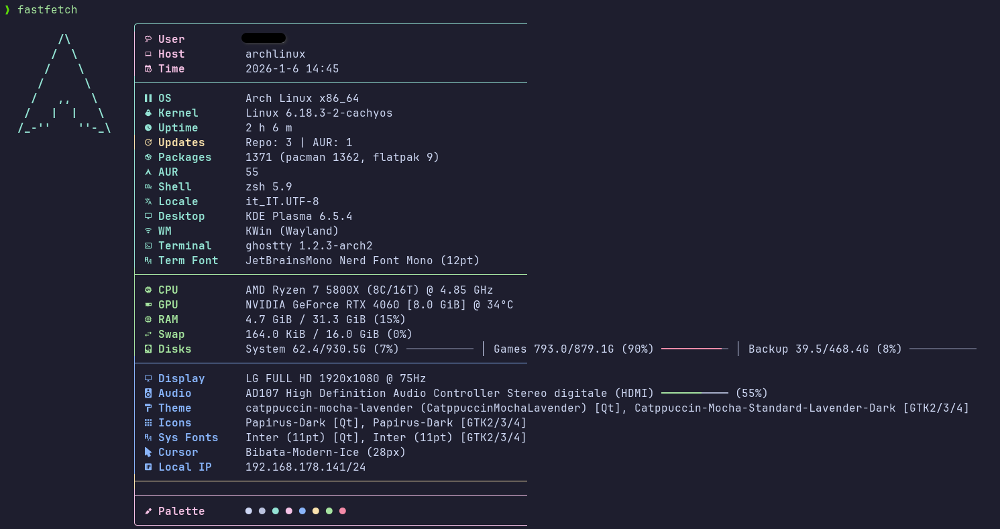

# Gold Fastfetch Config




A feature-rich, self-contained Fastfetch configuration installer for Arch Linux.

### ⚡ Quick Install
One-line command (clones to `/tmp`, installs, cleans up):
```bash
git clone --depth 1 https://github.com/Lucenx9/gold-fastfetch.git /tmp/gold-fastfetch && bash /tmp/gold-fastfetch/install.sh; rm -rf /tmp/gold-fastfetch
```

## Features

- **Auto GPU detection** - Nvidia (VRAM & Temp), AMD/Intel support
- **Auto disk detection** - Filesystem labels, colored progress bars (excludes network drives)
- **Update checker** - Cached pacman + AUR (Yay/Paru) update counts
- **Icon toggle** - Auto-detects Nerd Fonts, with manual override
- **Smart backups** - Automatic backup rotation (keeps last 5)
- **Media Ready** - Shows Now Playing & Player status (Spotify, VLC, etc.)
- **Gaming Ready** - Detects connected Gamepads/Controllers
- **Battery Status** - Shows battery percentage and charging status (for laptops)
- **XDG compliant** - Uses standard config/state/cache paths

## Compatibility

- **OS**: Optimized for **Arch Linux** (`pacman` needed for repo updates).
- **AUR**: Auto-detects `yay` or `paru` for AUR update counts.
- **Terminal**: Requires a Nerd Font for icons (optional).
- **GPU**: Detailed stats (VRAM/Temp) supported on NVIDIA. Intel/AMD show model/shared status.

## Requirements

- **Fastfetch** v2+
- **pciutils** (for `lspci`)
- **pacman-contrib** (highly recommended for update detection)
- **Nerd Font** (recommended for icons)

```bash
sudo pacman -S fastfetch pciutils pacman-contrib
```

## Installation

```bash
git clone https://github.com/Lucenx9/gold-fastfetch.git
cd gold-fastfetch
chmod +x install.sh
./install.sh
```

### Options

```bash
./install.sh --icons      # Force icons ON
./install.sh --no-icons   # Force icons OFF
./install.sh --variant gold      # Full setup (default)
./install.sh --variant minimal   # Lightweight setup
```

`gold` is the default variant because it includes the full detection stack (GPU, updates, disk helper scripts) and best showcases the project.

## What Gets Installed

| Item | Gold Variant | Minimal Variant | Source |
|------|--------------|-----------------|--------|
| `config.jsonc` | Installed | Installed | Generated from `templates/config-gold.jsonc` or `templates/config-minimal.jsonc` |
| `scripts/gpu_detect.sh` | Installed | Not installed | Copied from `templates/scripts/gpu_detect.sh` |
| `scripts/disk_detect.sh` | Installed | Not installed | Copied from `templates/scripts/disk_detect.sh` |
| `scripts/updates.sh` | Installed | Not installed | Copied from `templates/scripts/updates.sh` |

## Reset / Uninstall

To remove the configuration and restore your previous backup:

```bash
chmod +x uninstall.sh
./uninstall.sh
```

## Backups

Existing configs are backed up to:
```
~/.local/state/fastfetch/backups/backup_YYYYMMDD_HHMMSS/
```

Only the last 5 backups are kept.

## Development

Dependencies:

- `shellcheck`
- `bats`
- `fastfetch` (for local smoke runs)

Run lint:

```bash
shellcheck install.sh uninstall.sh scripts/lib.sh templates/scripts/*.sh
```

Run tests:

```bash
bats tests/
```

If `bats` is installed under `~/.local/bin`:

```bash
export PATH="$HOME/.local/bin:$PATH"
bats tests/
```

Regenerate snapshots after template changes:

```bash
./tests/update-snapshots.sh
```

## License

MIT


## Technical Details 🛠️

### 🚀 Smart Caching (updates.sh)
- **Problem**: Running `checkupdates` or `yay` on every term launch is slow.
- **Solution**: The script creates a cache file with a **30-minute TTL**.
- **Smart Invalidation**: It checks `/var/lib/pacman/local`. If you update your system, the cache is **instantly invalidated**, ensuring you always see real-time data without performance penalties.

### 💾 Dynamic Disk Detection (disk_detect.sh)
- **Problem**: Hardcoding disk paths (`/`, `/home`) fails on multi-drive setups.
- **Solution**: The script uses `findmnt` to dynamically discover **real** physical partitions.
- **Filtering**: Automatically excludes pseudo-filesystems (`tmpfs`, `overlay`, `/boot`, `/run`).
- **Visuals**: Generates color-coded storage bars directly in Bash.

### ⚡ Installation Logic
1. **Safety First**: Checks for `root` (blocks execution), verifies `Arch Linux` via `/etc/arch-release`.
2. **Backups**: Automatically backs up existing configs to `~/.local/state/fastfetch/backups/`.
3. **Generation**: The `.jsonc` config is **generated at runtime**, allowing it to inject variables (like Icons ON/OFF) based on your choices.
